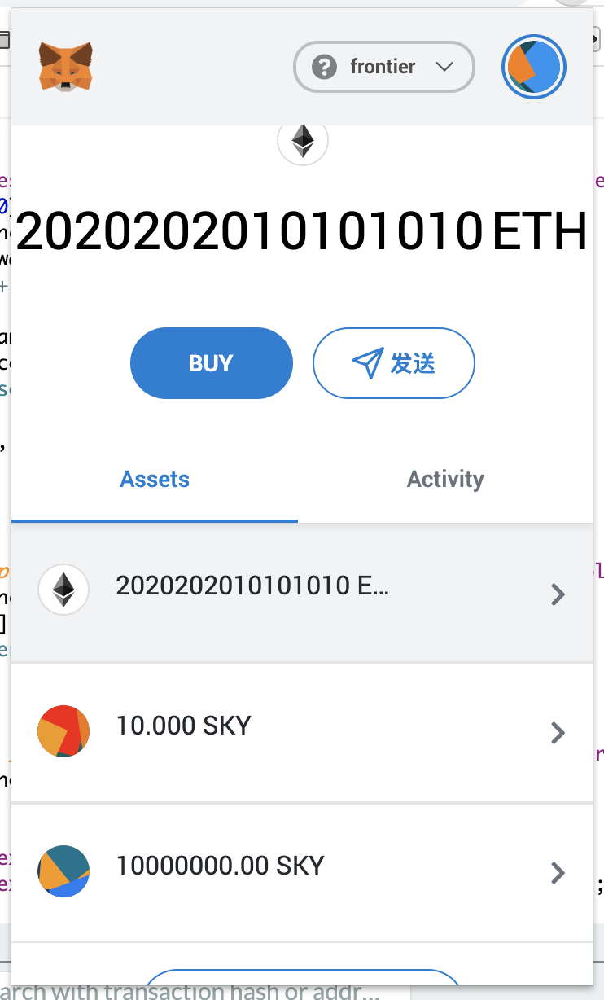

# Lesson11指令

## 操作账户

PrivateKey: `99B3C12287537E38C90A9219D4CB074A89A16E9CDB20BF85728EBD97C343E342`

Address: `0x6Be02d1d3665660d22FF9624b7BE0551ee1Ac91b`


## node启动

下载同路径下的`frontier.zip`文件到本地，并解压缩。

```bash
cd frontier
cargo build --release
```

启动节点：

```bash
cd frontier
./target/release/frontier-template-node purge-chain --dev
./target/release/frontier-template-node --dev
```

## 注意事项

gas limit: `4294967295`

运行frontier


连接matamask


ERC20 合约

```
pragma solidity ^0.6.0;

import "./SafeMath.sol";

contract ERC20 {
    
    using SafeMath for uint256;
    
    string private _name;
    string private _symbol;
    uint8 private _decimals;
    uint256 private _totalSupply;
    mapping(address => uint256) private _balances;
    mapping(address => mapping(address => uint256)) private _allowances;
    
    constructor(string memory myName, string memory mySymbol, uint256 myTotalSupply, uint8 myDecimals) public {
        _name = myName;
        _symbol = mySymbol;
        _totalSupply = myTotalSupply;
        _decimals = myDecimals;
        _balances[msg.sender] = myTotalSupply;
    }
    
    function name() public view returns (string memory) {
       return _name;
    }
    
    function symbol() public view returns (string memory) {
       return _symbol;
    }
    
    function totalSupply() public view returns (uint256) {
       return _totalSupply;
    }

   function balanceOf(address _owner) public view returns (uint256) {
       return _balances[_owner];
   }
   
   function transfer(address to, uint256 value) public returns (bool) {
       require(to != address(0), "ERC20 ERROR: transfer from zero address");
       require(value <= _balances[msg.sender]);
       require(_balances[to] + value >= _balances[to]);

       _balances[msg.sender] = _balances[msg.sender].sub(value);
       _balances[to] = _balances[to].add(value);

       emit Transfer(msg.sender, to, value);

       return true;
   }

   function transferFrom(address from, address to, uint256 value) public returns (bool) {
       require(to != address(0));
       require(value <= _balances[from]);
       require(value <= _allowances[from][msg.sender]);
       require(_balances[to] + value >= _balances[to]);

       _balances[from] = _balances[from].sub(value);
       _balances[to] = _balances[to].add(value);
       _allowances[from][msg.sender] = _allowances[from][msg.sender].sub(value);

       emit Transfer(from, to, value);

       return true;
   }

   function approve(address spender, uint256 value) public returns (bool) {
       require(value <= _balances[msg.sender]);
       _allowances[msg.sender][spender] = value;
       emit Approval(msg.sender, spender, value);
       return true;
   }

   function allowance(address _owner, address spender) public view returns (uint256) {
       return _allowances[_owner][spender];
   }

   event Transfer(address indexed from, address indexed to, uint256 value);
   event Approval(address indexed owner, address indexed spender, uint256 value);
}
```

获取代币


