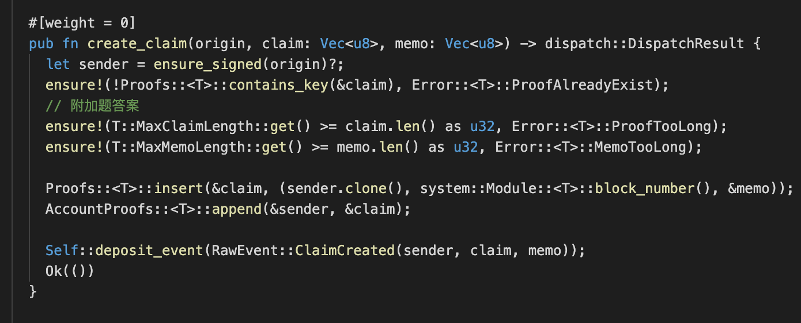
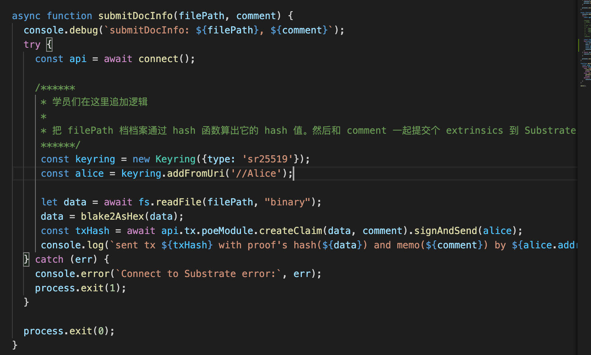
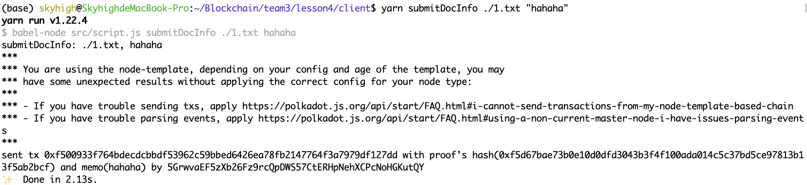
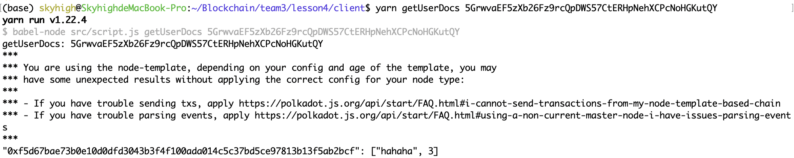

## 第四课作业

这一题是建基于第三课的功课。

#### 基本题 (5分)

修改 Substrate Node template 及客户端 (看下面交付 2a 及 2b, 二选其一) 使可以支持 用户指定选择一个档案，然后在客户端算出它的 档案 hash 值，并接受用户输入一组不长于 256 字符串的备注  然后把这些资讯以一个 signed transaction 发到 Substrate 网络。

>如果从档案算 hash 值，不确定确用什么 hash 函数的话，可用用 @polkadot/util-crypto ([NPM](https://www.npmjs.com/package/@polkadot/util-crypto)，[github](https://github.com/polkadot-js/common/tree/master/packages/util-crypto)) 内的 [blake2](https://github.com/polkadot-js/common/tree/master/packages/util-crypto/src/blake2) 或 [sha512](https://github.com/polkadot-js/common/tree/master/packages/util-crypto/src/sha512)。

修改node-template:

修改前端client

运行结果

#### 附加题(5分) - 本次附加题为必答题

下列 a) 或 b) 选一个作答

a) 增加一个功能，允许前端输入一个 AccountID，遍历显示属于该用户的文件 hash, 其创建时的 blockNumber，及其备注。UI 组件完成品应当显示如下：

b) 用 node.js 的话，则是以 polkadot-JS API 连接到 substrate 节点，實現 `async function getUserDocs` 函数。

修改前端client

运行结果

