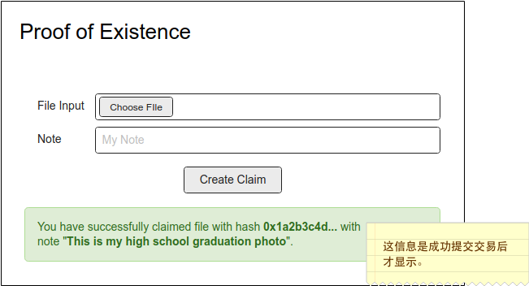
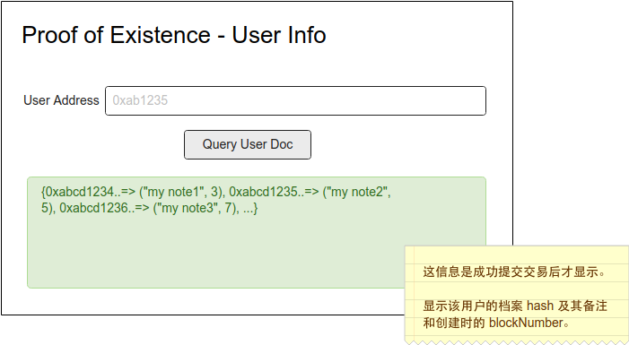

## 第四课作业

这一题是建基于第三课的功课。

#### 基本题 (5分)

修改 Substrate Node template 及客户端 (看下面交付 2a 及 2b, 二选其一) 使可以支持 用户指定选择一个档案，然后在客户端算出它的 档案 hash 值，并接受用户输入一组不长于 256 字符串的备注  然后把这些资讯以一个 signed transaction 发到 Substrate 网络。

如果从档案算 hash 值，不确定确用什么 hash 函数的话，可用用 @polkadot/util-crypto ([NPM](https://www.npmjs.com/package/@polkadot/util-crypto)，[github](https://github.com/polkadot-js/common/tree/master/packages/util-crypto)) 内的 [blake2](https://github.com/polkadot-js/common/tree/master/packages/util-crypto/src/blake2) 或 [sha512](https://github.com/polkadot-js/common/tree/master/packages/util-crypto/src/sha512)。

**交付**

  - 源代码
  - 目录里要有： 
    
    1) `substrate-node-template` 子目录。这是 substrate 节点的逻辑。
    
    2a) `substrate-front-end-template` 子目录。这是前端，在该 UI 组件内，增加一个可选择指定一个档案的输入，及一个文字栏的输入作备注。然后作签名提交交易。UI 组件完成品应当显示如下：

    
    
    2b) `client` 子目录。这是 node.js 客户端。以 polkadot-JS API 连接到 substrate 节点，實現 `async function submitDocInfo` 函数。

    ```javascript
    // 取得 ApiPromise, 连到去远端 Substrate 节点的代码

    async function submitDocInfo(filePath, comment) {
      // 把 filePath 档档案通过 hash 函数算出它的 hash 值。然后和 comment 一起提交个 extrinsics 到 Substrate
    }
    ```

    以下为运行方法:

    ```bash
    cd client
    yarn install
    yarn submitDocInfo <your-file-path> <comment>
    ``` 

#### 附加题(5分) - 本次附加题为必答题

下列 a) 或 b) 选一个作答

a) 增加一个功能，允许前端输入一个 AccountID，遍历显示属于该用户的文件 hash, 其创建时的 blockNumber，及其备注。UI 组件完成品应当显示如下：



b) 用 node.js 的话，则是以 polkadot-JS API 连接到 substrate 节点，實現 `async function getUserDocs` 函数。

```javascript
// 取得 ApiPromise, 连到去远端 Substrate 节点的代码

async function getUserDocs(acct) {
  // 通过用户 addr, 取得他所有的创建文件的 hash及相关资料。返回值是：
  // { "0xabcd1234...": ["my note1", 3], 
  //   "0xabcd1235...": ["my note2", 5], 
  //   "0xabcd1236...": ["my note3", 7], 
  //   ...
  // }
}
```

以下为运行方法:

```bash
cd client
yarn install
yarn getUserDocs <user-account>
```
