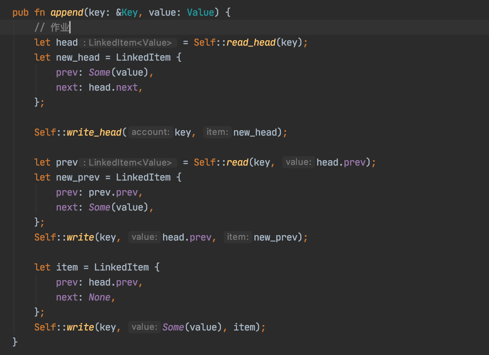
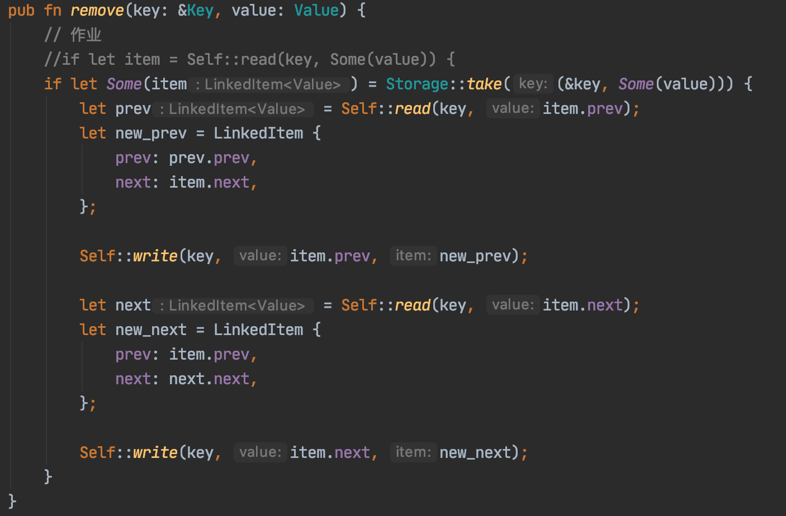
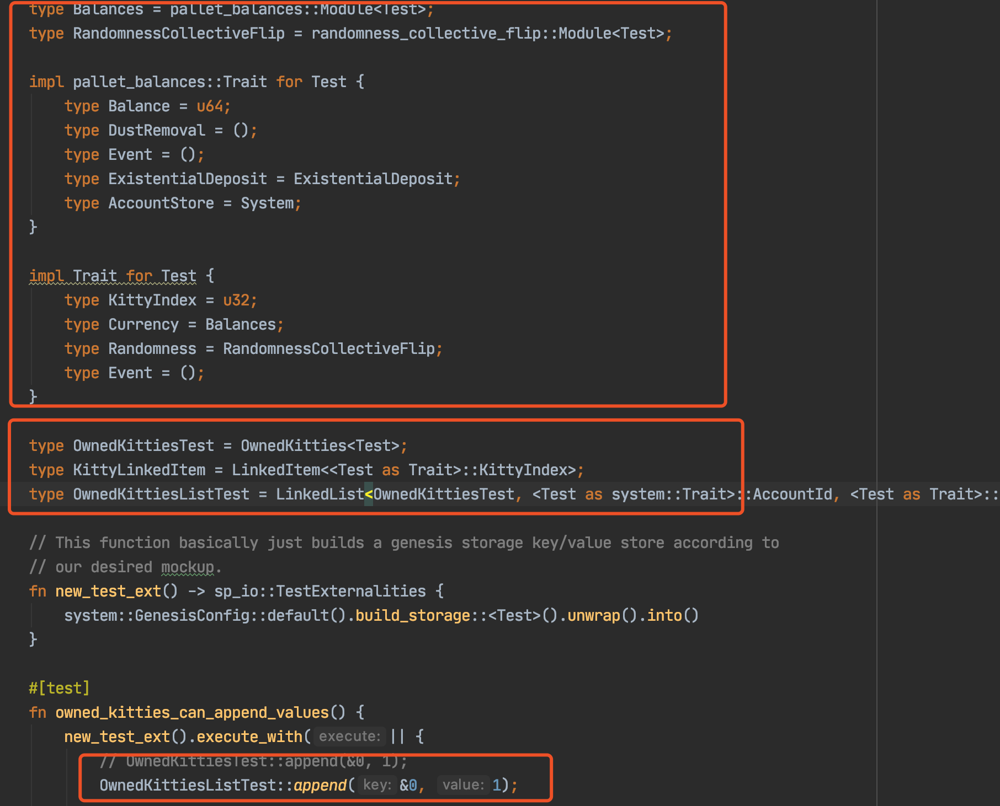
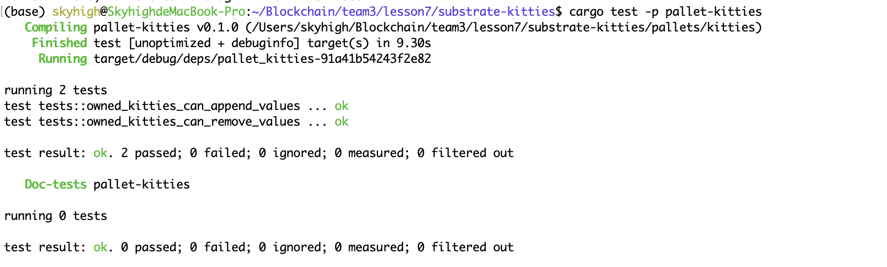
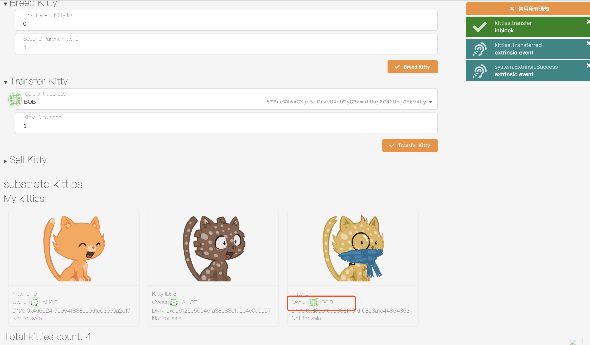
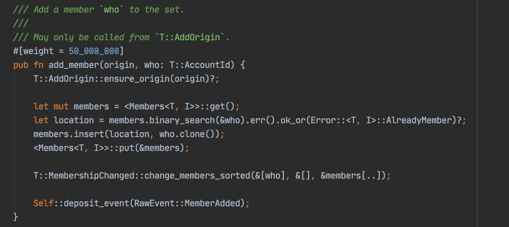

# lesson7 作业

1. 补完剩下的代码  
https://github.com/SubstrateCourse/substrate-kitties/blob/lesson7/pallets/kitties/src/linked_item.rs

 - append
 
 - remove
 

2. 修复单元测试   
- test code 要改挺多
 
 - 测试成功
 
 - 测试ui
 

3. 阅读 pallet-membership   
    
    - a. 分析 add_member 的计算复杂度  
      - 内存计算最差情况：O(N)
        members.binary_search: O(logN)
        members.insert: O(N)
      - T::AddOrigin::try_origin(origin) 包含磁盘读取解码
      - <Members<T, I>>::get() 包含磁盘读取解码
      - <Members<T, I>>::put(&members) 包含磁盘写入编码
      - change_members_sorted 包含磁盘写入
      -  Self::deposit_event(RawEvent::MemberAdded) 包含磁盘写入 
    - b. 分析 pallet-membership 是否适合以下场景下使用，提供原因   
      * i. 储存预言机提供者 
        - 可以
        - 一般预言机提供者数量不多，一般情况下都是具备一定资质的参与者，且不会频繁变动
      * ii. 储存游戏链中每个工会的成员
        - 不适合
        - 这种成员数量很大，并且会频繁变动   
      * iii. 储存 PoA 网络验证人  
        - 取决于具体验证人遴选规则
        - 如果验证人需要一定资质并限制人数在较低数量，并且不会频繁变动，则可以使用 
