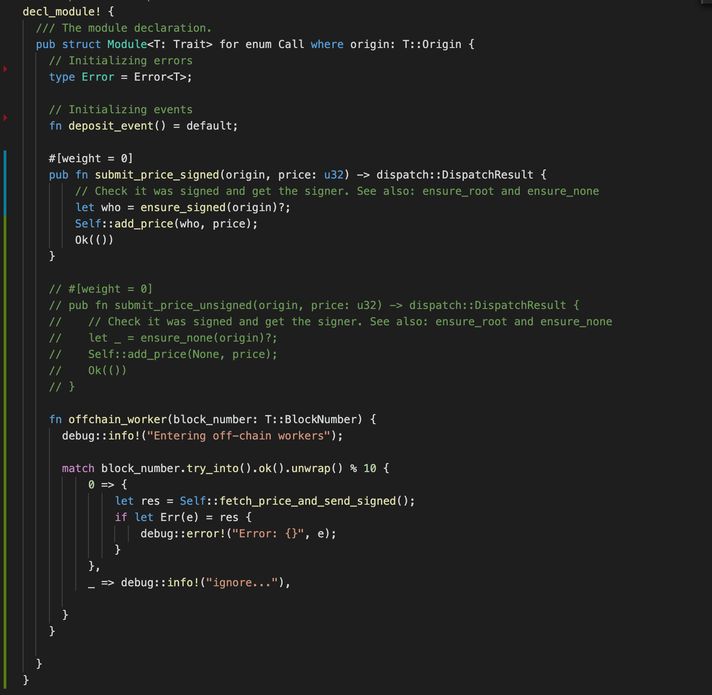
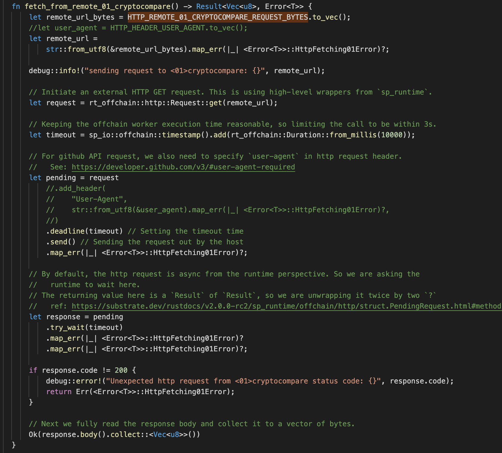
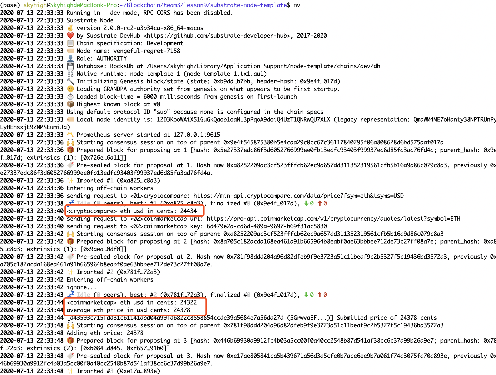
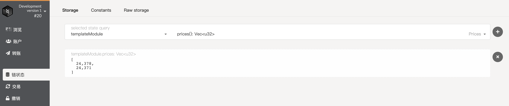

## 第九课作业

**(7 分)**

利用 off-chain worker，试从两个或以上的加密货币价格提供者 (最少两个)，透过其 API 取得 ETH 币的价格，
取其平均值，然后把它推 (append) 到 ocw 链下储存的 Vec 内。

加密货币价格提供者包括以下：
  - https://coinmarketcap.com/
  - https://coincap.io/
  - https://www.cryptocompare.com/
  - 其他你自己找到的提供者也可以

  offchain代码
  
  fetch代码
  

  运行得到price
  

**(3 分)** 

附加题：为你的 ocw 写单元测试

动态获取price, 用浏览器测试有效性, 写入vec, 价格*100
  
